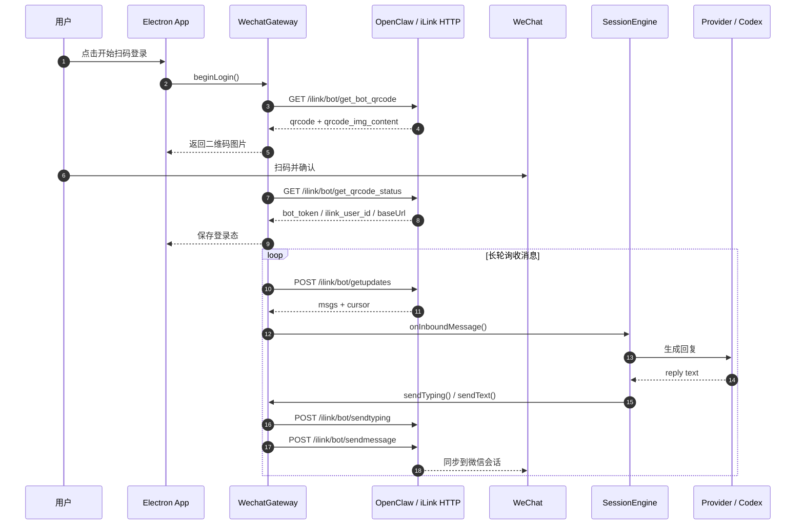
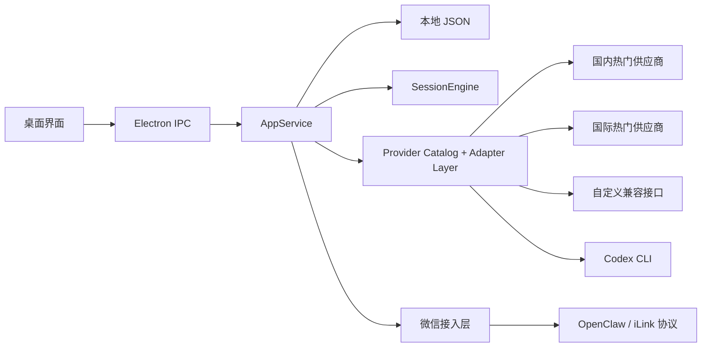

# WeChat Agent Desktop

`WeChat Agent Desktop` 是一个把微信扫码登录、消息轮询、联系人上下文和 AI 助手接入打包成桌面应用的实验性项目。它面向“不想自己搭协议层、也不想在命令行里折腾”的用户，让微信私聊接入助手这件事更接近开箱即用。

本项目当前基于 OpenClaw / iLink 协议做微信接入，支持国内外热门 AI 供应商、自定义兼容接口和 Codex CLI 等多种回复来源。
当前微信接入链路走的是 OpenClaw / iLink 暴露的 HTTP 接口，收消息使用长轮询，不是 WebSocket。

## 开源说明

- 本项目以 MIT License 开源，见 [LICENSE](./LICENSE)
- 本项目与腾讯、微信、OpenAI、DeepSeek、Codex 官方均无隶属或背书关系
- 微信接入依赖非官方协议能力，协议变动、接口风控、账号限制或服务下线都可能导致功能失效
- 请勿在生产或高敏感场景直接使用，建议仅用于学习、研究和受控验证

## 项目用途

- 把“微信接入 + 助手接入 + 桌面交互”收敛到单个 Electron 应用
- 让普通用户不需要自己安装 OpenClaw，也能完成扫码登录和消息闭环
- 为更懂技术的用户提供 `Codex（高级）` 模式，把本地代码仓库接进微信私聊

## 技术栈

- Electron
- TypeScript
- 原生 HTML / CSS / JavaScript 渲染层
- esbuild
- 本地 JSON 持久化
- OpenClaw / iLink 协议接入
- 可选 Provider：
  - 国内热门：DeepSeek、通义千问、智谱 GLM、豆包、Kimi、SiliconFlow
  - 国际热门：OpenAI、Anthropic Claude、Google Gemini、xAI Grok、OpenRouter
  - 自定义接口：OpenAI / Anthropic / Gemini 协议
  - Codex CLI

## 功能概览

- 微信二维码登录
- 自动恢复登录态与长轮询
- 私聊文本消息接收与回发
- typing 状态发送
- 联系人开关、上下文清空、运行日志查看
- 多种助手模式：
  - `演示助手`
  - `国内热门供应商`
  - `国际热门供应商`
  - `自定义接口`
  - `Codex（高级）`

## 启动方式

安装依赖并启动：

```bash
npm install
npm run start
```

构建与类型检查：

```bash
npm run build
npm run typecheck
```

如果 Electron 二进制下载失败，可改用镜像：

```bash
ELECTRON_MIRROR=https://npmmirror.com/mirrors/electron/ npm install
npm run start
```

## 打包方式

macOS 打包：

```bash
npm run dist:mac
```

Windows 打包：

```bash
npm run dist:win
```

通用打包：

```bash
npm run dist
```

产物默认输出到：

```text
release/
```

说明：

- 打包产物已内置 Electron 运行时
- `演示助手` 不依赖外部模型
- 云端供应商模式需要用户自行填写 API Key
- `Codex（高级）` 需要本机已安装并登录 `codex`
- macOS 未签名应用首次启动可能需要手动放行

## 目录结构

```text
wechat-agent-desktop/
├── docs/
│   ├── ADVANCED-CODEX.md
│   ├── ARCHITECTURE.md
│   ├── PROJECT-OVERVIEW.md
│   ├── PROVIDERS.md
│   └── VALIDATION.md
├── scripts/
│   ├── after-pack.mjs
│   └── build.mjs
├── src/
│   ├── main/
│   │   ├── agent-provider.ts
│   │   ├── app-service.ts
│   │   ├── ipc.ts
│   │   ├── main.ts
│   │   ├── openclaw.ts
│   │   ├── preload.ts
│   │   ├── provider-catalog.ts
│   │   ├── session-engine.ts
│   │   ├── store.ts
│   │   ├── types.ts
│   │   └── wechat-gateway.ts
│   └── renderer/
│       ├── app.js
│       ├── index.html
│       └── styles.css
├── CONTRIBUTING.md
├── LICENSE
├── README.md
├── SECURITY.md
└── package.json
```

## 主流程

1. 用户在桌面界面点击“开始扫码登录”
2. 应用通过 OpenClaw / iLink 拉取二维码内容并生成本地二维码
3. 用户扫码确认后，应用保存微信登录态并启动长轮询
4. 新私聊消息进入后，系统按联系人维护独立上下文
5. `SessionEngine` 根据当前 Provider 和协议适配器生成回复
6. `WechatGateway` 把文本消息和 typing 状态回发给微信
7. `JsonStore` 持久化设置、联系人、运行日志和登录态

## 微信协议链路

- 当前实现不是浏览器网页注入，也不是 WebSocket 常连
- 桌面端通过 OpenClaw / iLink 的 HTTP API 完成扫码、轮询、发消息和 typing
- 新消息接收方式是 `getupdates` 长轮询



## 核心模块

### `src/main/main.ts`

- Electron 主进程入口
- 配置 `userData` 路径
- 创建主窗口并注册 IPC

### `src/main/app-service.ts`

- 应用编排中心
- 串联设置、登录、运行状态、联系人和日志
- 对渲染层暴露统一快照

### `src/main/wechat-gateway.ts`

- 封装微信协议相关调用
- 负责扫码登录、长轮询、发消息和 typing
- 处理登录态失效和状态同步

### `src/main/session-engine.ts`

- 维护“一个联系人一条上下文”
- 对入站消息串行处理
- 做联系人级别的异常隔离

### `src/main/agent-provider.ts`

- 统一封装不同 Provider
- 当前支持 `mock`、多家云端供应商、`custom`、`codex`
- 负责把回复整理成适合微信发送的文本

### `src/main/provider-catalog.ts`

- 维护供应商目录、默认地址、默认模型和协议类型
- 作为前端表单和主进程请求分发的单一来源

### `src/main/store.ts`

- 使用本地 JSON 持久化设置、联系人、运行状态和日志
- 保持轻量，不引入数据库

## 风险点

- 当前只支持私聊，不支持群聊
- 当前只支持文本回复，图片、文件、语音仍未打通
- OpenClaw / iLink 协议变化可能导致登录或轮询失效
- `Codex` 模式依赖用户本机已安装并登录 `codex`
- 当前没有自动化测试，仍以手工验证为主
- 登录凭证和 API Key 当前保存在本地 JSON 文件中，未做系统级密钥托管
- 不同供应商的模型名和权限策略不同，默认模型更像模板值，必要时需要用户手动调整

## Mermaid 图



## 阅读路线

1. 先看 [README.md](./README.md) 了解产品边界和启动方式
2. 再看 [docs/ARCHITECTURE.md](./docs/ARCHITECTURE.md) 理解分层
3. 接着读 [src/main/app-service.ts](./src/main/app-service.ts) 抓主流程
4. 想看微信接入时读 [src/main/wechat-gateway.ts](./src/main/wechat-gateway.ts)
5. 想看模型与本地 Agent 接入时读 [src/main/agent-provider.ts](./src/main/agent-provider.ts)
6. 想看界面交互时读 [src/renderer/app.js](./src/renderer/app.js)

## 使用步骤

1. 打开应用后点击“开始扫码登录”
2. 用微信扫码并确认
3. 在“助手设置”里选择所需模式
4. 根据模式填写 API Key 或选择本地工作目录
5. 扫码确认后开始接收消息
6. 在微信私聊里与 Bot 对话

## 文档

- [架构说明](./docs/ARCHITECTURE.md)
- [项目总览](./docs/PROJECT-OVERVIEW.md)
- [Provider 说明](./docs/PROVIDERS.md)
- [Codex 高级模式](./docs/ADVANCED-CODEX.md)
- [手工验证指南](./docs/VALIDATION.md)
- [贡献指南](./CONTRIBUTING.md)
- [安全策略](./SECURITY.md)

## 阅读后建议先做什么

- 想快速跑通闭环：先用 `演示助手`
- 想验证国内模型：切到 `DeepSeek` 或 `通义千问`
- 想验证国外模型：切到 `OpenAI`、`Claude` 或 `Gemini`
- 想接其它兼容服务：使用 `自定义接口`
- 想接本地代码仓库：开启高级模式后使用 `Codex`

## 中文总结

这个项目的目标不是做一个裸协议 SDK，而是把“微信接入 + Agent 接入”产品化成一个桌面端 MVP。它已经具备扫码登录、消息轮询、真实模型回复和本地代码助手接入这些关键闭环；如果要继续往公开仓库和可分发产品推进，当前最值得优先补的，是协议风险提示、凭证安全、自动化测试和更稳定的分发流程。
