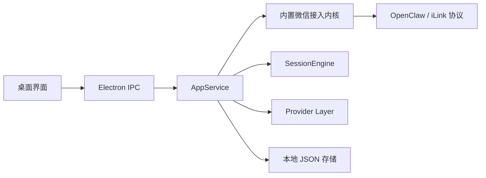

# 架构说明

## 产品定位

- 普通用户看到的是“微信智能助手桌面版”
- OpenClaw/iLink 只是内置的微信接入内核
- DeepSeek 是默认推荐的真实模型模式
- Codex 是高级代码助手模式

## 当前架构

## 模块说明

### `src/main/wechat-gateway.ts`
- 负责二维码登录
- 负责长轮询 `getupdates`
- 负责发送文本消息和 typing
- 对上层暴露统一的微信事件

### `src/main/session-engine.ts`
- 每个联系人一条独立上下文
- 入站消息串行处理
- 统一调用不同 Provider
- 负责异常隔离与回复状态写回

### `src/main/agent-provider.ts`
- 统一封装不同助手来源
- 当前支持：
  - `mock`
  - `deepseek`
  - `openai`
  - `codex`

### `src/main/store.ts`
- 使用本地 JSON 保存配置、联系人、日志和微信状态
- 当前版本刻意保持轻量，没有引入数据库

## 标准模式与高级模式

### 标准模式
- 演示助手
- DeepSeek
- OpenAI 兼容

特点：
- 普通用户可用
- 不要求理解本地 Agent
- 只需要填 API Key 或基础模型参数

### 高级模式
- Codex

特点：
- 面向更懂技术的用户
- 需要本机已有 `codex`
- 可以读取或修改指定工作目录

## 为什么要把 OpenClaw 内置

- 大多数用户不会自己安装 OpenClaw
- 大多数用户也不需要理解 OpenClaw
- 对产品来说，微信接入属于基础能力，不该暴露成用户安装步骤

所以当前做法是：
- 在代码里直接内置微信协议层
- 产品层只暴露“扫码登录微信”

## 当前边界

- 只支持私聊
- 只支持文本回复
- `Codex` 模式当前依赖本机已有登录态
- 还没有自动安装或自动登录 `codex`
