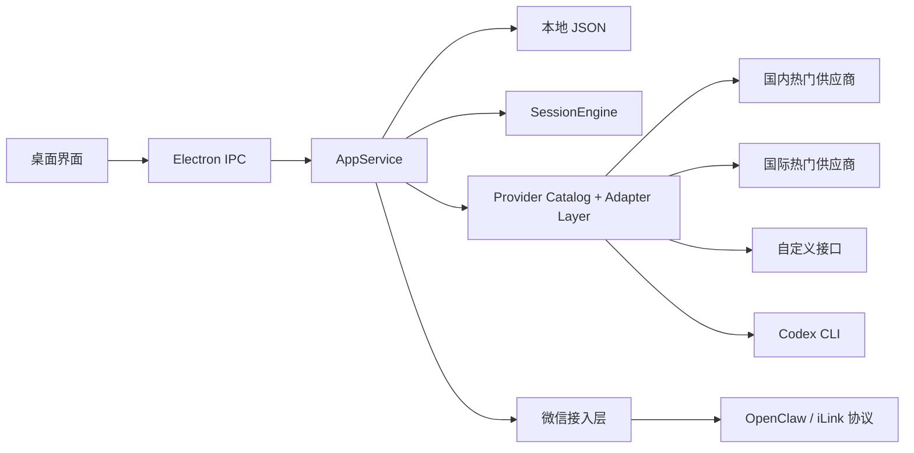

# 项目总览

## 项目用途

`WeChat Agent Desktop` 是一个面向非程序员的轻量桌面应用。它把微信扫码登录、消息轮询、联系人上下文和 AI 助手接入收拢到一个图形界面里，让用户不用自己安装 OpenClaw、不用写命令行，也能把助手接进微信私聊。

## 技术栈

- Electron
- TypeScript
- 原生 HTML / CSS / JavaScript 渲染层
- 本地 JSON 持久化
- OpenClaw / iLink 协议接入
- 可选 Provider：
  - 国内热门：DeepSeek、通义千问、智谱 GLM、豆包、Kimi、SiliconFlow
  - 国际热门：OpenAI、Anthropic Claude、Google Gemini、xAI Grok、OpenRouter
  - 自定义接口
  - Codex CLI

## 启动方式

安装与启动：

```bash
npm install
npm run start
```

构建与类型检查：

```bash
npm run build
npx tsc --noEmit
```

如果 Electron 下载失败：

```bash
ELECTRON_MIRROR=https://npmmirror.com/mirrors/electron/ npm install
```

## 目录结构

```text
wechat-agent-desktop/
├── docs/
│   ├── ADVANCED-CODEX.md
│   ├── ARCHITECTURE.md
│   ├── PROJECT-OVERVIEW.md
│   ├── PROVIDERS.md
│   └── VALIDATION.md
├── scripts/
│   └── build.mjs
├── src/
│   ├── main/
│   │   ├── agent-provider.ts
│   │   ├── app-service.ts
│   │   ├── ipc.ts
│   │   ├── main.ts
│   │   ├── openclaw.ts
│   │   ├── preload.ts
│   │   ├── provider-catalog.ts
│   │   ├── session-engine.ts
│   │   ├── store.ts
│   │   ├── types.ts
│   │   └── wechat-gateway.ts
│   └── renderer/
│       ├── app.js
│       ├── index.html
│       └── styles.css
├── package.json
└── README.md
```

## 主流程

1. 用户在桌面界面点击“开始扫码登录”
2. 应用通过 OpenClaw / iLink 获取登录链接，并在本地转成二维码
3. 微信扫码确认后，应用保存登录态并开始长轮询
4. 新私聊消息进入后，系统按联系人建立独立上下文
5. `SessionEngine` 调用选中的 Provider 生成回复
6. 应用通过微信网关把文本和 typing 状态回发给微信
7. 日志、联系人状态和最近上下文在 UI 中实时刷新

## 核心模块

### [`src/main/main.ts`](../src/main/main.ts)

- Electron 主进程入口
- 创建窗口
- 配置项目专属 `userData` 目录
- 自动兼容旧的 `Electron/app-data.json`

### [`src/main/app-service.ts`](../src/main/app-service.ts)

- 应用编排中心
- 串联设置、微信登录、运行状态、联系人和日志
- 对渲染层暴露统一快照

### [`src/main/wechat-gateway.ts`](../src/main/wechat-gateway.ts)

- 封装 OpenClaw / iLink 微信协议
- 负责扫码登录、登录态轮询、消息轮询、发消息、typing

### [`src/main/session-engine.ts`](../src/main/session-engine.ts)

- 维护“一个联系人一条上下文”
- 对入站消息串行排队
- 隔离单联系人异常，避免互相影响

### [`src/main/agent-provider.ts`](../src/main/agent-provider.ts)

- 统一 Provider 抽象
- 当前支持 `mock`、多家云端供应商、`custom`、`codex`
- 把不同来源的回复统一整理成适合微信发送的文本

### [`src/main/provider-catalog.ts`](../src/main/provider-catalog.ts)

- 维护供应商预设、默认地址、默认模型和协议类型
- 作为主进程和前端设置表单的共享配置源

### [`src/main/store.ts`](../src/main/store.ts)

- 以本地 JSON 持久化设置、联系人、微信状态和日志
- 刻意保持轻量，不引入数据库

## 风险点

- 当前只支持私聊，不支持群聊
- 当前只支持文本回复，图片、文件、语音仍未打通
- OpenClaw / iLink 协议如果变化，登录和轮询可能失效
- `Codex` 模式依赖用户本机已安装并登录 `codex`
- 目前没有自动化测试，仍以手工验证为主
- Provider 切换时如果不清空历史，上下文风格可能串味

## Mermaid 图



## 阅读路线

1. 先看 [`README.md`](../README.md) 了解产品边界和启动方式
2. 再看 [`docs/ARCHITECTURE.md`](./ARCHITECTURE.md) 理解分层
3. 接着读 [`src/main/app-service.ts`](../src/main/app-service.ts) 抓主流程
4. 想看微信接入时读 [`src/main/wechat-gateway.ts`](../src/main/wechat-gateway.ts)
5. 想看模型与本地 Agent 接入时读 [`src/main/agent-provider.ts`](../src/main/agent-provider.ts)
6. 想看界面交互时读 [`src/renderer/app.js`](../src/renderer/app.js)

## 中文总结

这个项目的核心不是再做一个协议 SDK，而是把微信接入和 Agent 接入产品化。当前实现已经把“扫码登录微信 + 多供应商文本回复 + 高级模式接入 Codex”这一条主链打通；下一步更值得优先补的，是供应商级密钥管理、媒体消息、自动化测试和更细的多账号配置。
