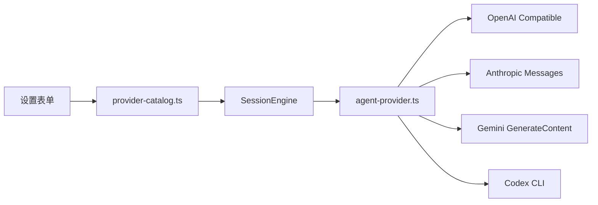

# Provider 说明

## 当前支持的助手类型

## 1. 演示助手

适合：
- 验证微信登录和消息闭环
- 不接真实模型时快速测试

特点：
- 不需要 API Key
- 不会调用外部模型
- 回复内容固定偏演示性质

## 2. 国内热门供应商

当前内置预设：
- DeepSeek
- 通义千问（DashScope）
- 智谱 GLM
- 豆包（火山方舟）
- Kimi（Moonshot）
- SiliconFlow

特点：
- 默认填充官方或兼容 Base URL
- 默认填充一组可编辑的模型模板
- 统一走云端 Provider 抽象，便于继续扩容

说明：
- 豆包通常需要填写“推理接入点 ID”，不是自然语言模型名
- SiliconFlow 是聚合平台，模型名通常是 `厂商/模型` 形式

## 3. 国际热门供应商

当前内置预设：
- OpenAI
- Anthropic Claude
- Google Gemini
- xAI Grok
- OpenRouter

特点：
- OpenAI / xAI / OpenRouter 走 OpenAI Chat Completions 兼容协议
- Anthropic 走官方 Messages API
- Gemini 走官方 GenerateContent API

## 4. 自定义接口

适合：
- 对接未内置的平台
- 对接自建网关、代理或聚合平台

特点：
- 可手动选择协议：
  - OpenAI Chat Completions
  - Anthropic Messages
  - Gemini GenerateContent
- 可手动填写 Base URL、Model、API Key

## 5. Codex（高级）

适合：
- 代码仓库问答
- 本地项目分析
- 在工作目录里让 Agent 给出修改建议，或直接执行改动

特点：
- 依赖本机 `codex` 命令
- 依赖本机已有 `codex login`
- 支持选择工作目录
- 支持两种权限模式：
  - `只读问答`
  - `允许在工作目录内修改文件`

## Provider 架构

## Provider 选择建议

### 面向普通用户
- 默认优先 `DeepSeek`
- 想接国外官方服务时优先 `OpenAI` 或 `Gemini`

### 面向想统一接多个模型的人
- 国内优先 `SiliconFlow`
- 国际优先 `OpenRouter`

### 面向做代码问题分析的人
- 开启高级模式后使用 `Codex`

## 当前实现边界

- 目前统一的是“文本对话”能力，还没有处理图片、语音、工具调用
- 默认模型值主要用于快速起步，不保证覆盖每个账号下的可用模型
- 本地只保存一套当前选中的云端配置，还没有做多供应商凭证分组管理
